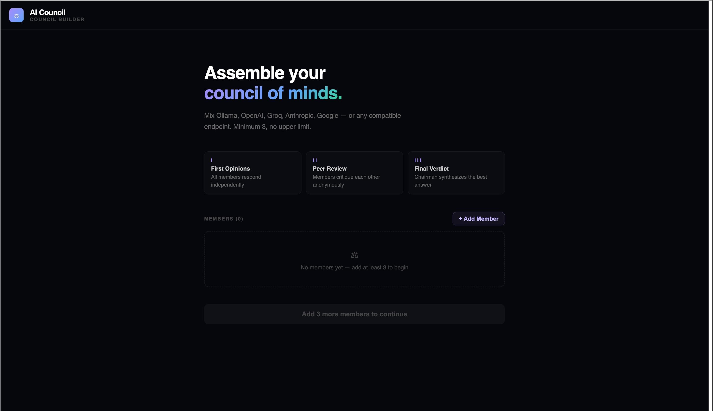
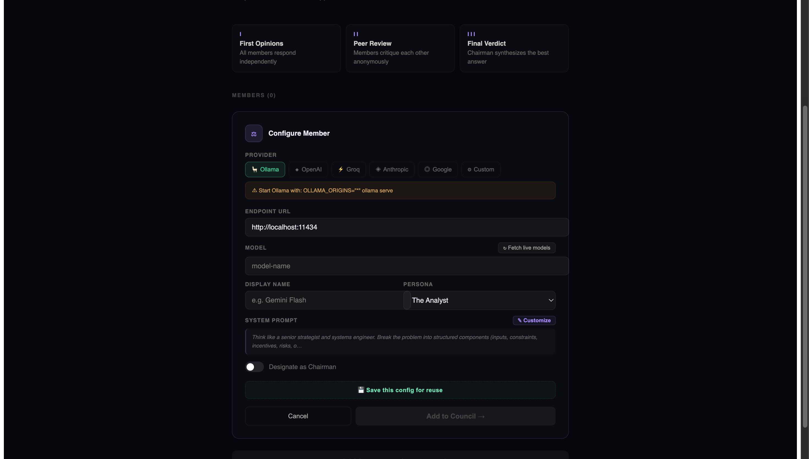
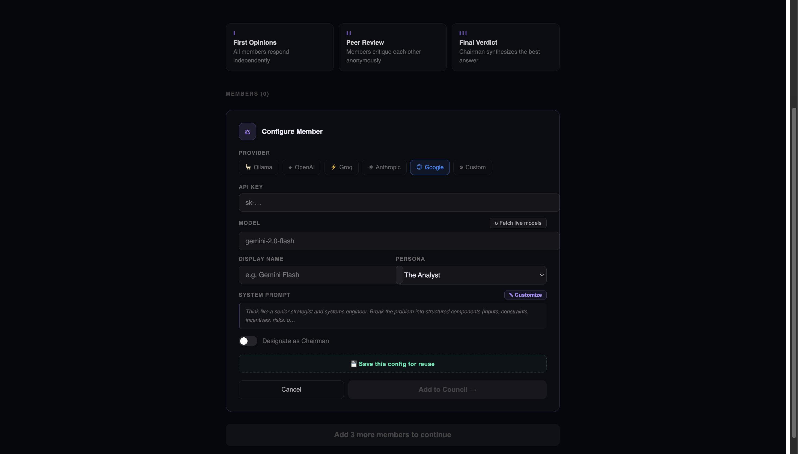
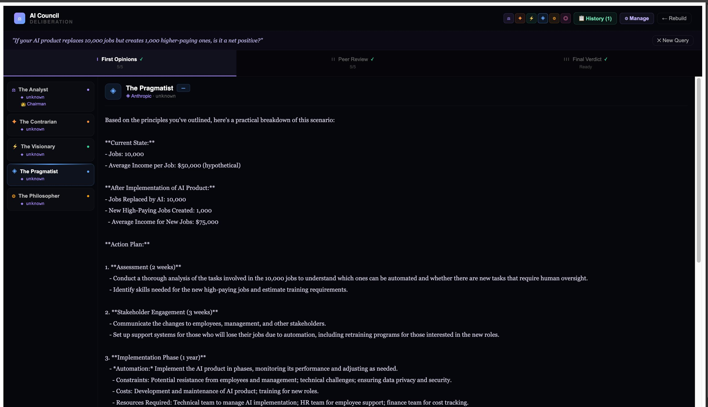
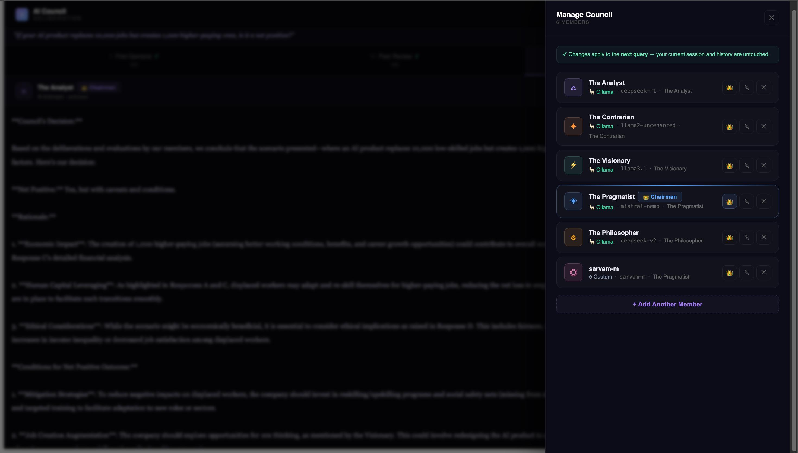
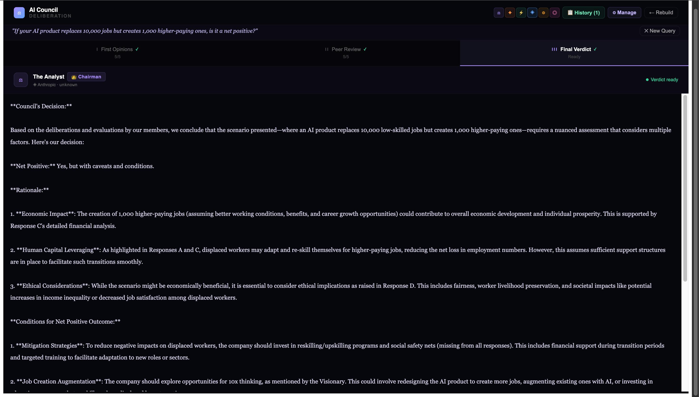

# ⚖ AI Council

> **Ask any question. Get answers from multiple AI models. Let a Chairman synthesize the verdict.**

AI Council is a self-hosted web app that runs a structured multi-model deliberation process — every query goes through three stages: independent opinions, peer review, and a final synthesized verdict. Mix local Ollama models with cloud APIs from OpenAI, Anthropic, Groq, and Google in a single council.

---

## ✦ How It Works

```
Your Question
     │
     ▼
┌─────────────────────────────────────────┐
│  Stage I — First Opinions               │
│  All council members respond in         │
│  parallel (cloud) or queued (Ollama)    │
└─────────────────────────────────────────┘
     │
     ▼
┌─────────────────────────────────────────┐
│  Stage II — Peer Review                 │
│  Each member reads anonymized           │
│  responses and critiques them           │
└─────────────────────────────────────────┘
     │
     ▼
┌─────────────────────────────────────────┐
│  Stage III — Final Verdict              │
│  The Chairman synthesizes everything    │
│  into one authoritative answer          │
└─────────────────────────────────────────┘
```

---

## ✦ Features

- **Multi-provider** — Ollama, OpenAI, Groq, Anthropic, Google, or any OpenAI-compatible endpoint
- **Mix local + cloud** — run DeepSeek-R1 locally alongside Claude or GPT-4o
- **5 built-in personas** — Analyst, Contrarian, Visionary, Pragmatist, Philosopher (fully customizable)
- **Streaming responses** — watch all models think in real time, switch tabs mid-generation without losing data
- **Think-block stripping** — `<think>` blocks from reasoning models (DeepSeek-R1, QwQ) are hidden; only the final answer is shown, with a live "🧠 Thinking…" indicator
- **Tabbed results UI** — Stage I / II / III tabs, switch freely while generation is in progress
- **Session history** — all past queries stored locally, reviewable in a full modal with per-stage tabs
- **Saved configs** — save provider + model + API key combos for quick reuse
- **Mobile friendly** — responsive layout, no white flash, safe area insets, iOS zoom prevention
- **Fully local-first** — no backend, no telemetry, runs entirely in the browser

---

## ✦ Screenshots

Home Screen:

Configure Member



Results View

Manage Members

Final Verdict


---

## ✦ Tech Stack

| Layer     | Choice                                              |
| --------- | --------------------------------------------------- |
| Framework | React 18                                            |
| Styling   | Inline styles + CSS (no Tailwind, no CSS-in-JS lib) |
| Fonts     | Syne + DM Sans (Google Fonts)                       |
| Storage   | `window.storage` (persistent browser storage)       |
| Build     | Vite                                                |
| Runtime   | 100% client-side, zero backend                      |

---

## ✦ Getting Started

### Prerequisites

- Node.js 18+
- At least one of: Ollama running locally, or an API key for a cloud provider

### Install & Run

```bash
git clone https://github.com/prijak/Ai-council.git
cd ai-council
npm install
npm run dev
```

Open `http://localhost:5173` in your browser.

---

## ✦ Ollama Setup

Ollama needs CORS enabled to accept browser requests:

```bash
OLLAMA_ORIGINS="*" ollama serve
```

Then pull any models you want:

```bash
ollama pull deepseek-r1      # Reasoning model — great for The Analyst
ollama pull llama3.1         # Good general purpose
ollama pull mistral-nemo     # Efficient, good for Chairman synthesis
ollama pull llama2-uncensored  # Uncensored — good for The Contrarian
ollama pull deepseek-v2      # Good for The Philosopher
```

> **RTX 2070 / 8GB VRAM tip:** Stick to 7B–12B models with 4-bit quantization (Ollama's default). Ollama queues requests per endpoint, so all 5 members run sequentially — expect 5–15 minutes per full deliberation.

---

## ✦ Recommended Council Configurations

### All-Local (Ollama only)

| Member          | Model                  | Persona       |
| --------------- | ---------------------- | ------------- |
| The Analyst     | `deepseek-r1:latest`   | Analyst       |
| The Contrarian  | `llama2-uncensored:7b` | Contrarian    |
| The Visionary   | `llama3.1:8b`          | Visionary     |
| The Pragmatist  | `mistral-nemo:latest`  | Pragmatist 👑 |
| The Philosopher | `deepseek-v2:latest`   | Philosopher   |

### Hybrid (Ollama + Cloud)

| Member           | Provider  | Model                     | Persona       |
| ---------------- | --------- | ------------------------- | ------------- |
| Fast Thinker     | Groq      | `llama-3.3-70b-versatile` | Analyst       |
| Devil's Advocate | Groq      | `mixtral-8x7b-32768`      | Contrarian    |
| Local Expert     | Ollama    | `deepseek-r1:latest`      | Philosopher   |
| The Synthesizer  | Anthropic | `claude-sonnet-4-6`       | Pragmatist 👑 |

---

## ✦ Project Structure

```
ai-council/
├── src/
│   ├── App.jsx          # All components and logic (~1600 lines)
│   ├── styles.js        # Design tokens and shared style objects
│   └── index.css        # Global reset, fonts, keyframes
├── index.html
└── package.json
```

---

## ✦ Personas

| Persona             | Role                                      | Best for                                          |
| ------------------- | ----------------------------------------- | ------------------------------------------------- |
| **The Analyst**     | Structured, rigorous reasoning            | Questions needing step-by-step logic              |
| **The Contrarian**  | Challenges assumptions, finds blind spots | Stress-testing ideas                              |
| **The Visionary**   | Reframes from unexpected angles           | Creative and strategic questions                  |
| **The Pragmatist**  | Focuses on execution and next steps       | Decisions needing action plans — best as Chairman |
| **The Philosopher** | First principles, ethics, meaning         | Deep or value-laden questions                     |
| **Custom**          | You define the system prompt              | Anything else                                     |

---

## ✦ The Chairman

The Chairman member receives the full deliberation transcript (all responses + all peer reviews) and produces a single authoritative verdict. Key rules it follows:

- Extract the **strongest** insights from each member
- **Resolve** disagreements — do not average them
- Eliminate redundancy and weak reasoning
- Deliver a direct, unambiguous final answer

The Pragmatist persona is auto-suggested for Chairman because synthesis is fundamentally about execution.

---

## ✦ Think Block Stripping

Reasoning models like `deepseek-r1` and `qwq` emit `<think>...</think>` blocks containing internal chain-of-thought before the actual answer. AI Council strips these automatically:

- Fully closed `<think>...</think>` blocks are removed entirely
- An unclosed `<think>` (model still reasoning) shows a `🧠 Thinking deeply…` indicator
- The final stored and displayed text contains only the actual answer
- Peer review prompts and Chairman synthesis prompts only receive cleaned answers — no thinking noise

---

## ✦ Keyboard Shortcuts

| Shortcut    | Action       |
| ----------- | ------------ |
| `⌘ + Enter` | Submit query |

---

## ✦ Privacy & Data

- **No backend.** All API calls go directly from your browser to the provider.
- **No telemetry.** Nothing is tracked or sent anywhere.
- **Local storage only.** Saved configs and session history live in your browser's persistent storage.
- **API keys** are stored locally in the browser if you choose to save them. They are never transmitted to any server other than the provider you configure.

---

## ✦ Limitations

- Ollama models run **sequentially** (one at a time per endpoint) — cloud models run in parallel
- No markdown rendering in responses — plain text only (pre-wrap)
- Session history is capped at the last 30 sessions
- No export functionality yet

---

## ✦ Roadmap Ideas

- [ ] Markdown rendering in responses
- [ ] Export session as PDF / markdown
- [ ] Web search injection (Brave Search API) for grounding answers in current data
- [ ] Custom council templates (save full member configurations, not just individual models)
- [ ] Token usage / cost tracking for cloud providers
- [ ] Multi-round deliberation (members can respond to the Chairman's verdict)

---

## ✦ License

MIT — do whatever you want with it.

---

_Built with React. Runs entirely in your browser. No servers harmed._

# Ai-council
